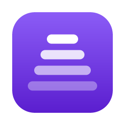

# Babelay

**지금 재생 중인 소리를 실시간 자막으로. 전사와 번역 모두 내 컴퓨터 안에서.**

로컬 우선 · 오픈 소스 · 클라우드 없이 동작

Babelay는 회의, 강의, 영상, 스트리밍 등 **컴퓨터에서 나오는 모든 소리**를 잡아 실시간으로 받아 적고, 원하면 번역해서 **화면 위에 떠 있는 자막**으로 보여주는 데스크톱 앱입니다. 오디오는 컴퓨터 밖으로 나가지 않습니다. 전사는 whisper.cpp, 번역은 로컬 LLM(llama.cpp)이 처리하며, 원할 때만 클라우드 번역 API를 붙일 수 있습니다.

목차

- [소개](#소개)
- [왜 Babelay인가](#왜-babelay인가)
- [주요 기능](#주요-기능)
- [설치](#설치)
- [사용법](#사용법)
- [기능 자세히](#기능-자세히)
- [데이터가 저장되는 곳](#데이터가-저장되는-곳)
- [시스템 구조](#시스템-구조)
- [개발자용](#개발자용)
- [기여](#기여)

## 소개

외국어 회의에 참석하거나, 자막 없는 영상을 보거나, 실시간 방송을 따라갈 때 Babelay를 켜 두면 됩니다. 앱은 시스템 오디오를 직접 캡처하므로 마이크나 가상 오디오 장치를 따로 설정할 필요가 없습니다. 말이 끝나는 대로 문장이 확정되고, 번역이 붙으면 원문과 번역이 한 세트로 오버레이에 나타납니다. 모든 세션은 히스토리에 남아 검색하고 SRT나 TXT로 내보낼 수 있습니다.

## 왜 Babelay인가

- **오디오가 밖으로 나가지 않습니다.** 캡처, 전사, 번역이 모두 내 컴퓨터 안에서 끝납니다. 클라우드 번역은 켤 때만, 텍스트만 보냅니다.
- **비용이 없습니다.** 기본 구성은 무료 오픈 모델(Whisper, Qwen, Gemma)만 씁니다. 구독도 API 키도 필요 없습니다.
- **어디에나 얹을 수 있습니다.** 오버레이는 항상 위에 떠 있고 클릭을 통과시키므로 어떤 앱 위에서도 자막처럼 쓸 수 있습니다.
- **하드웨어에 맞춥니다.** 앱이 GPU와 메모리를 보고 전사·번역 모델 조합을 추천합니다. Apple Silicon은 Metal, NVIDIA는 CUDA로 가속합니다.

## 주요 기능

- **시스템 오디오 실시간 전사.** macOS는 Core Audio Process Tap, Windows는 WASAPI 루프백으로 재생 중인 소리를 그대로 받습니다.
- **로컬 또는 클라우드 번역.** Qwen 3.5, Gemma 3를 로컬에서 돌리거나 OpenAI, Anthropic, Google Gemini, DeepL, OpenAI 호환 엔드포인트를 연결합니다.
- **화면 위 오버레이 자막.** 원문+번역, 원문만, 번역만 세 가지 표시 모드. 위치와 폭은 드래그로 조정하고 다중 모니터를 기억합니다.
- **언어 자동 감지.** 한국어, 영어, 일본어를 감지하거나 원어를 고정할 수 있습니다. 원어와 자막 언어가 같으면 번역 없이 바로 보여줍니다.
- **세션 히스토리.** 모든 세션을 저장하고 전문 검색하며 SRT와 TXT로 내보냅니다.
- **트레이와 전역 단축키.** 창을 닫아도 트레이에서 캡처와 오버레이를 켜고 끕니다. `Cmd/Ctrl+Shift+S`로 캡처, `Cmd/Ctrl+Shift+O`로 오버레이를 토글합니다.
- **장치 변경 자가 복구.** 세션 중 출력 장치가 바뀌거나 빠져도 캡처가 이어집니다.
- **한국어, 영어, 일본어 UI.** 다크와 라이트 테마.

## 설치

[Releases](https://github.com/bob-park/babelay-app/releases)에서 최신 버전을 받습니다.

### 🍎 macOS (14.2 이상, Apple Silicon)

1. `.dmg`를 열고 **Babelay**를 응용 프로그램 폴더로 끌어 놓습니다.
2. 처음 실행하면 **시스템 오디오 녹음** 권한을 묻습니다. 허용해야 소리가 들어옵니다. 나중에 바꾸려면 시스템 설정 → 개인정보 보호 및 보안 → 화면 및 시스템 오디오 녹음에서 Babelay를 켭니다.
3. 온보딩에서 UI 언어와 모델을 고르면 바로 쓸 수 있습니다.

### 🪟 Windows (10 이상, x64)

1. `.exe` 설치 파일을 실행합니다. 서명되지 않은 빌드라 SmartScreen 경고가 뜨면 **추가 정보 → 실행**을 누릅니다.
2. 별도 권한은 필요 없습니다. NVIDIA GPU가 있으면 CUDA로 자동 가속하고, 없으면 CPU로 동작합니다. CUDA 런타임은 앱에 포함되어 있어 따로 설치하지 않습니다.
3. 온보딩에서 UI 언어와 모델을 고르면 바로 쓸 수 있습니다.

### 🐧 Linux

지원하지 않습니다.

## 사용법

1. **모델 준비.** 첫 실행 온보딩에서 전사·번역 모델을 받습니다. 하드웨어에 맞는 조합에는 **추천** 배지가 붙습니다. 설정 › 모델에서 언제든 바꾸거나 더 받을 수 있습니다.
2. **시작.** 사이드바의 **시작** 버튼, 트레이 메뉴, 또는 `Cmd/Ctrl+Shift+S`. 캡처 중에는 버튼이 어두워지고 무지개 링이 돕니다.
3. **자막 보기.** 오버레이가 켜져 있으면 화면 아래에 자막이 뜹니다. 라이브 페이지에서는 타임라인으로 전체 흐름을 봅니다.
4. **오버레이 조정.** 설정 › 오버레이의 **조정** 버튼을 누르면 오버레이를 드래그해 옮기고 오른쪽 아래 손잡이로 폭을 바꿀 수 있습니다. 다른 모니터로 옮기면 그 모니터를 기억합니다.
5. **번역 설정.** 설정 › 번역에서 자막 언어와 번역기를 고릅니다. 클라우드를 쓰려면 API 키를 넣고 **연결 테스트**로 확인합니다.
6. **히스토리.** 지난 세션을 열어 읽거나 검색하고, SRT 또는 TXT로 내보냅니다.

## 기능 자세히

### 🎯 전사 모델

Hugging Face `ggerganov/whisper.cpp`의 GGML 모델을 앱 안에서 받습니다.

| 모델 | 용량 | 특징 |
|---|---|---|
| Whisper Tiny | 75 MB | 가장 빠름, 정확도 낮음 |
| Whisper Base | 142 MB | GPU 없는 환경의 기본값 |
| Whisper Small | 466 MB | VRAM 8 GB 이상의 기본값 |
| Whisper Medium | 1.5 GB | |
| Whisper Large v3 Turbo | 1.6 GB | VRAM 16 GB 이상의 기본값 |
| Whisper Large v3 | 3.1 GB | 가장 정확, 가장 느림 |

### 🤖 번역 모델

로컬 번역은 GGUF Q4_K_M 모델을 llama.cpp로 돌립니다.

| 모델 | 용량 |
|---|---|
| Gemma 3 1B | 0.8 GB |
| Qwen 3.5 2B | 1.4 GB |
| Gemma 3 4B | 2.5 GB |
| Qwen 3.5 4B | 2.5 GB |

클라우드 번역은 OpenAI, Anthropic, Google Gemini, DeepL, 그리고 OpenAI 호환 커스텀 엔드포인트를 지원합니다. API 키는 OS 자격 증명 저장소(macOS 키체인, Windows 자격 증명 관리자)에만 저장되고 설정 파일에는 들어가지 않습니다.

### 🪧 오버레이 표시 모드

| 모드 | 동작 |
|---|---|
| 원문 + 번역 | 번역이 도착하는 순간 번역(굵은 흰색)과 원문(작은 회색)이 한 세트로 바뀝니다. |
| 원문 | 번역하지 않고 확정된 원문을 바로 보여줍니다. |
| 번역 | 원문 + 번역과 같은 타이밍에 번역만 보여줍니다. |

### 🔍 히스토리와 내보내기

세션은 로컬 SQLite에 저장되고 원문과 번역 모두 전문 검색됩니다. SRT는 블록마다 원문 줄과 번역 줄을, TXT는 `원문<TAB>번역` 형식으로 내보냅니다.

### ⚡ GPU 가속

- **macOS.** Metal로 전사와 번역을 가속합니다.
- **Windows.** NVIDIA GPU에서 CUDA로 가속합니다. GPU 로드가 실패하면 자동으로 CPU로 내려가고 라이브 페이지에 `CPU` 배지가 뜹니다.

## 데이터가 저장되는 곳

| 항목 | macOS | Windows |
|---|---|---|
| 설정 `settings.json` | `~/Library/Application Support/org.bobpark.babelay` | `%APPDATA%\org.bobpark.babelay` |
| 히스토리 `history.sqlite` | 위와 같음 | `%LOCALAPPDATA%\org.bobpark.babelay` |
| 모델 `models/asr`, `models/llm` | 위와 같음 | `%LOCALAPPDATA%\org.bobpark.babelay` |
| API 키 | 키체인, 서비스 `com.babelay.app` | 자격 증명 관리자, 서비스 `com.babelay.app` |

## 시스템 구조

프로세스는 하나입니다. Rust + Tauri 2 백엔드가 오디오 캡처, whisper.cpp 전사, llama.cpp 번역, SQLite 히스토리를 맡고, React + TypeScript 프론트엔드가 메인 창, 오버레이, 온보딩을 그립니다. 엔진은 Tauri에 의존하지 않는 별도 크레이트라 단독으로 테스트할 수 있습니다. 자세한 설계는 [설계 문서](docs/superpowers/specs/2026-09-02-babelay-design.md)에 있습니다.

## 개발자용

Rust와 Node.js가 필요합니다. 빌드, 검증, macOS 서명, Windows CUDA 툴체인 설정은 [개발 가이드](docs/development.md)를 보세요.

## 기여

이슈와 PR을 환영합니다. 머지 전 로컬 게이트(타입 검사, 프론트 테스트, Rust 테스트, clippy)는 개발 가이드에 있습니다. CI는 없고 빌드는 로컬에서만 합니다.
